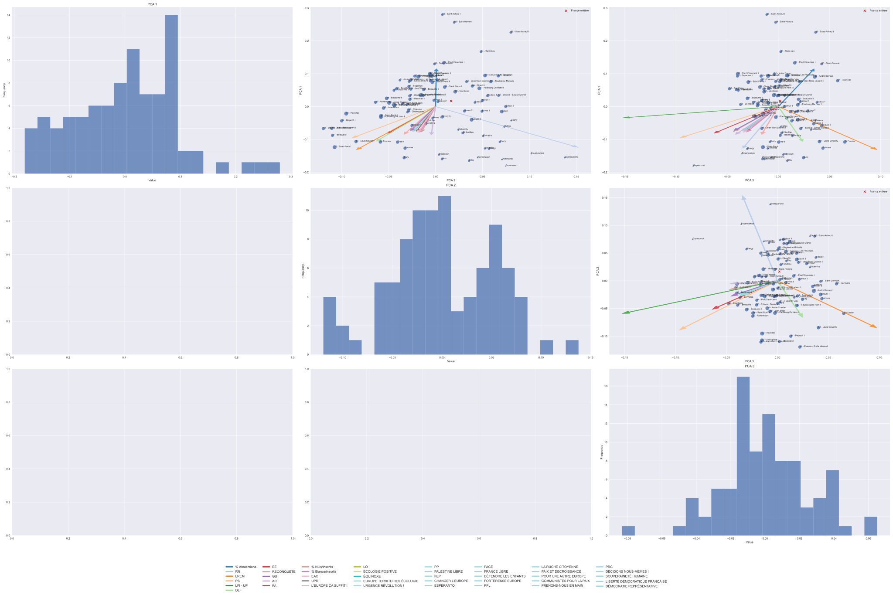
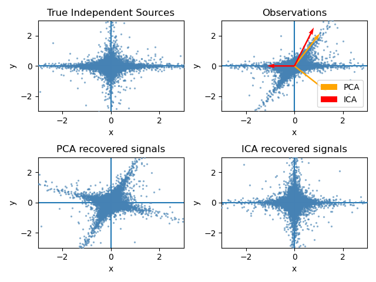
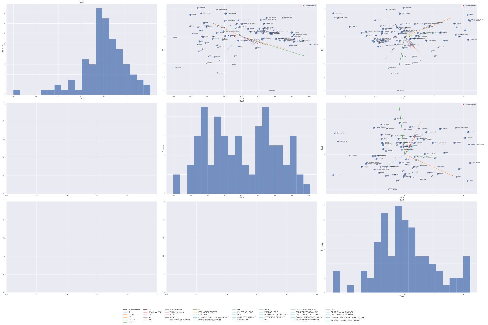

# Guide pour Interpréter des Graphiques de Nuages de Points Obtenus par Réduction de Dimension

## Introduction

Bienvenue dans ce guide conçu pour vous aider à interpréter les graphiques de nuages de points issus de l'Analyse en Composantes Indépendantes (ICA). Nous utiliserons comme exemple les données de distribution du vote aux élections européennes de 2024. Ce guide est destiné aux néophytes souhaitant comprendre comment utiliser ICA pour analyser des données complexes et déterminer où concentrer leurs efforts de campagne.

## Guide pour Interpréter des Graphiques de Nuages de Points avec Analyse en Composantes Principales (PCA)

### Introduction

Bienvenue dans ce guide conçu pour vous aider à interpréter les graphiques de nuages de points issus de l'Analyse en Composantes Principales (PCA). Nous utiliserons comme exemple les données de distribution du vote aux élections européennes de 2024. Ce guide est destiné aux néophytes souhaitant comprendre comment utiliser PCA pour analyser des données complexes et déterminer où concentrer leurs efforts de campagne.

### Qu'est-ce que la PCA?

L'Analyse en Composantes Principales (PCA) est une technique statistique utilisée pour réduire la dimensionnalité d'un jeu de données tout en conservant le plus d'information possible. Elle transforme les données initiales en un nouveau système de coordonnées, où chaque nouvelle dimension (composante principale) est une combinaison linéaire des dimensions initiales qui capture le maximum de variance.

### Comment la PCA Fonctionne-t-elle?

1. Standardisation: Les données sont standardisées (moyenne de 0 et écart-type de 1) pour que chaque feature ait le même poids.
2. Calcul de la Matrice de Covariance: La covariance entre les différentes features est calculée.
3. Calcul des Valeurs Propres et Vecteurs Propres: Les valeurs propres et les vecteurs propres de la matrice de covariance sont déterminés. Les valeurs propres représentent la quantité de variance expliquée par chaque vecteur propre (composante principale).
4. Projection des Données: Les données sont projetées sur les axes des vecteurs propres, créant un nouveau jeu de données dans le système de coordonnées des composantes principales.

### Interprétation des Graphiques de Nuages de Points avec PCA

1. Points de Données Projetés:
   - Chaque point sur le graphique représente un bureau de vote.
   - Les coordonnées de ces points sont définies par les premières composantes principales.
   - La position relative des points indique des similarités ou des différences dans les patterns de vote.
2. Vecteurs des Features Initiales:
   - Les vecteurs (flèches) représentent les axes des features initiales (par exemple, le % de vote pour un parti X).
   - La direction et la longueur des vecteurs indiquent l'importance et l'orientation de chaque feature dans l'espace des composantes principales.
   - Les vecteurs proches de la direction d'une composante principale indiquent une forte corrélation avec cette composante.
3. Variance Expliquée:
   - La longueur des axes sur le graphique correspond à la quantité de variance expliquée par chaque composante principale.
   - Les premières composantes principales expliquent généralement la majorité de la variance dans les données.

### Utilisation des Graphiques PCA pour la Campagne Électorale

1. Identifier les Zones de Campagne:
   - Analysez les clusters (groupes) de points sur le graphique.
   - Les clusters indiquent des groupes de bureaux de vote ayant des patterns de vote similaires.
   - Les bureaux de vote situés dans des clusters spécifiques peuvent être ciblés pour des messages de campagne personnalisés.
2. Comprendre l'Impact des Caractéristiques:
   - Les vecteurs des features vous aident à comprendre quelles caractéristiques influencent le plus les votes dans chaque cluster.
   - Par exemple, si un cluster de points est aligné avec le vecteur de l'âge moyen élevé, vous pouvez cibler ce groupe avec des messages adaptés aux personnes âgées.
3. Optimiser les Ressources:
   - Concentrez vos efforts sur les bureaux de vote qui montrent des patterns de vote indécis ou ceux qui peuvent être influencés par vos messages de campagne.
   - Utilisez les informations des vecteurs des features pour créer des stratégies de campagne efficaces, basées sur les caractéristiques les plus influentes dans chaque région.

### Campagne de la Circo 2 d'Amiens

(Vous pouvez télécharger les figures!)

### Conclusion

La PCA est un outil puissant pour réduire la dimensionnalité des données et révéler des patterns cachés dans les votes. En utilisant les graphiques de nuages de points et en interprétant correctement les positions relatives des points par rapport aux vecteurs des features, vous pouvez obtenir des insights précieux pour optimiser votre campagne électorale. La PCA permet de visualiser clairement les principales sources de variation dans vos données, ce qui est essentiel pour cibler vos efforts de manière plus efficace.  
  
Pour la réduction de dimension et la visualisation, la PCA est généralement préférée en raison de sa simplicité et de son efficacité pour capturer la variance maximale des données. L'ICA est plus adaptée pour identifier des facteurs indépendants cachés, mais est moins intuitive pour la réduction de dimension et la visualisation des données, même si elle peut être intéressante à consulter aussi dans certains cas. Notons que si on s'attend à trouver plusieurs dynamiques de vote différentes et indépendantes, l'ICA est un bon candidat à regarder.

## Guide pour Interpréter des Graphiques de Nuages de Points avec Analyse en Composantes Indépendantes (ICA)

### Qu'est-ce que l'ICA?

L'Analyse en Composantes Indépendantes (ICA) est une technique statistique avancée utilisée pour séparer un mélange de signaux\*\* en ses composantes originales. Cette méthode est particulièrement utile lorsque les signaux originaux sont indépendants les uns des autres et que leur distribution n'est pas gaussienne\*\*\*.

Dans le contexte de l'analyse de données électorales, l'ICA peut être utilisée pour identifier les facteurs indépendants qui influencent les résultats des élections. Par exemple, supposons que nous ayons collecté des données sur les résultats des élections dans différentes régions d'un pays, telles que le nombre de votes pour chaque candidat, le taux de participation, l'âge moyen des électeurs, le revenu moyen, etc. Cependant, ces données peuvent être mélangées de manière complexe et il peut être difficile de comprendre quels facteurs ont réellement influencé les résultats des élections.

L'ICA peut aider à résoudre ce problème en identifiant les facteurs indépendants qui sous-tendent les données électorales. Pour ce faire, l'ICA utilise des algorithmes d'optimisation^ pour estimer les sources indépendantes qui ont contribué aux données observées. Dans notre exemple, cela pourrait aider à identifier les facteurs indépendants tels que l'âge des électeurs et le revenu moyen qui ont influencé les résultats des élections.

Il convient de noter que l'ICA est une technique complexe qui nécessite une compréhension approfondie des mathématiques et des statistiques. Cependant, de nombreux outils logiciels sont disponibles pour aider les analystes à appliquer l'ICA à leurs données.

Dans le contexte de l'analyse de données électorales, l'ICA peut être utilisée pour identifier les facteurs indépendants qui influencent les résultats des élections.

Contrairement à l'Analyse en Composantes Principales (PCA), qui maximise la variance expliquée par chaque composante, l'ICA vise à rendre les composantes aussi indépendantes que possible.

---

\*\*Signaux : Dans le contexte de l'ICA, un signal est une quantité mesurable qui varie dans le temps ou l'espace. Par exemple, le nombre de votes pour un candidat dans une région donnée peut être considéré comme un signal.

\*\*\*Distribution gaussienne : Une distribution gaussienne est une distribution de probabilité couramment utilisée pour décrire les données aléatoires. Elle est également connue sous le nom de distribution normale ou courbe en cloche.

^ Algorithmes d'optimisation : Les algorithmes d'optimisation sont des méthodes mathématiques utilisées pour trouver la meilleure solution à un problème donné. Dans le contexte de l'ICA, les algorithmes d'optimisation sont utilisés pour estimer les sources indépendantes qui ont contribué aux données observées.

### Les Différences Entre ICA et PCA

PCA:

- Objectif: Maximiser la variance.
- Composantes: Orthogonales (i.e. toutes les composantes ont un angle droit entre elles).
- Utilisation: Réduction de dimension, détection de patterns globaux.
- Projection: Les points sont projetés sur les axes de variance maximale.

ICA:

- Objectif: Maximiser l'indépendance statistique.
- Composantes: Statistiquement indépendantes.
- Utilisation: Séparation des signaux, identification de sources cachées.
- Projection: Les points sont projetés sur des axes d'indépendance maximale.

#### Exemple

### Interprétation des Graphiques de Nuages de Points avec ICA

1. Points de Données Projetés:
   - Chaque point sur le graphique représente un bureau de vote.
   - Les coordonnées de ces points sont définies par les composantes indépendantes.
   - La position relative des points indique des similarités ou des différences dans les patterns de vote.
2. Vecteurs des Features Initiales:
   - Les vecteurs (flèches) représentent les axes des features initiales (par exemple, des caractéristiques démographiques ou socio-économiques).
   - La direction et la longueur des vecteurs indiquent l'importance et l'orientation de chaque feature dans l'espace des composantes indépendantes.
3. Position Relative des Points et des Vecteurs:
   - Les points proches de la direction d'un vecteur sont fortement influencés par la feature représentée par ce vecteur.
   - Si un bureau de vote est situé loin de l'origine dans la direction d'un vecteur, cela indique que cette caractéristique joue un rôle significatif dans ce bureau.

### Utilisation des Graphiques ICA pour la Campagne Électorale

1. Identifier les Zones de Campagne:
   - Analysez les clusters (groupes) de points sur le graphique.
   - Les clusters indiquent des groupes de bureaux de vote ayant des patterns de vote similaires.
   - Les bureaux de vote situés dans des clusters spécifiques peuvent être ciblés pour des messages de campagne personnalisés.
2. Comprendre l'Impact des Caractéristiques:
   - Les vecteurs des features vous aident à comprendre quelles caractéristiques influencent le plus les votes dans chaque cluster.
   - Par exemple, si un cluster de points est aligné avec le vecteur de l'âge moyen élevé, vous pouvez cibler ce groupe avec des messages adaptés aux personnes âgées.
3. Optimiser les Ressources:
   - Concentrez vos efforts sur les bureaux de vote qui montrent des patterns de vote indécis ou ceux qui peuvent être influencés par vos messages de campagne.
   - Utilisez les informations des vecteurs des features pour créer des stratégies de campagne efficaces, basées sur les caractéristiques les plus influentes dans chaque région.

### Campagne Circo 2 Amiens

### Conclusion

L'ICA est un outil puissant pour analyser les données complexes des élections et identifier des patterns cachés dans les votes. En utilisant les graphiques de nuages de points et en interprétant correctement les positions relatives des points par rapport aux vecteurs des features, vous pouvez obtenir des insights précieux pour optimiser votre campagne électorale. Rappelez-vous que l'objectif est de maximiser l'indépendance statistique, ce qui vous permet de comprendre mieux les différentes influences sur les votes et de cibler vos efforts de manière plus efficace.